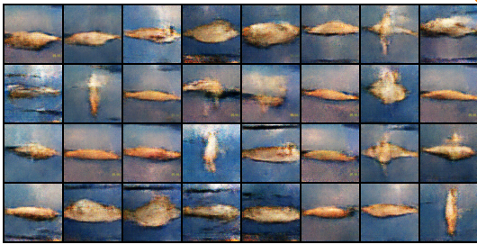

# This fish does not exist

## Dataset

[A Large Scale Fish Dataset](https://www.kaggle.com/crowww/a-large-scale-fish-dataset)

## Results

### Observations

- There is a need for a dataset with a larger distribution of data
- Need more tracking for logging of performance results

## References

- [Pytorch DCGan Faces Tutorial](https://pytorch.org/tutorials/beginner/dcgan_faces_tutorial.html#)
- [Aladdin Persson's DCGan Tutorial](https://www.youtube.com/watch?v=IZtv9s_Wx9I)
- [D2L DCGan Section](http://d2l.ai/chapter_generative-adversarial-networks/dcgan.html)
